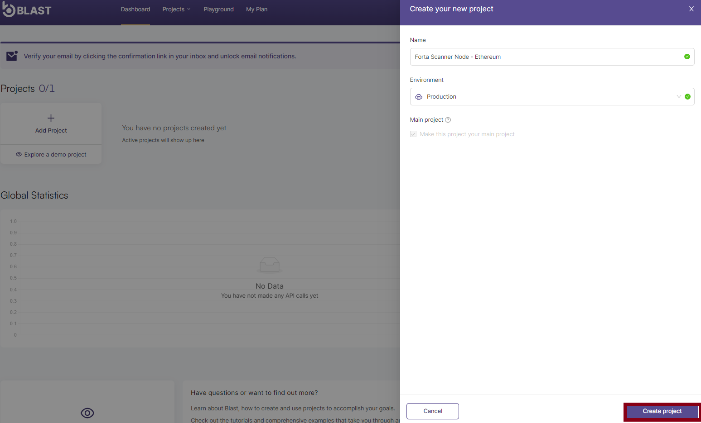
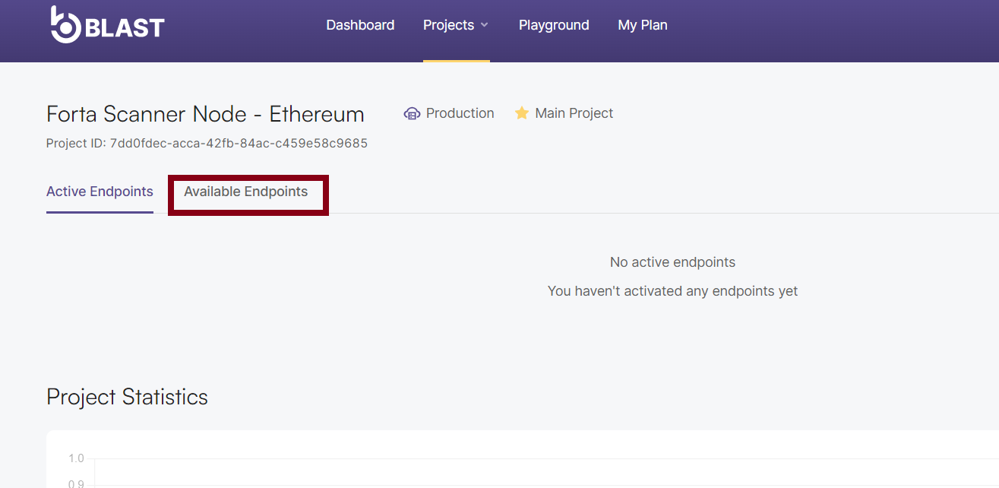
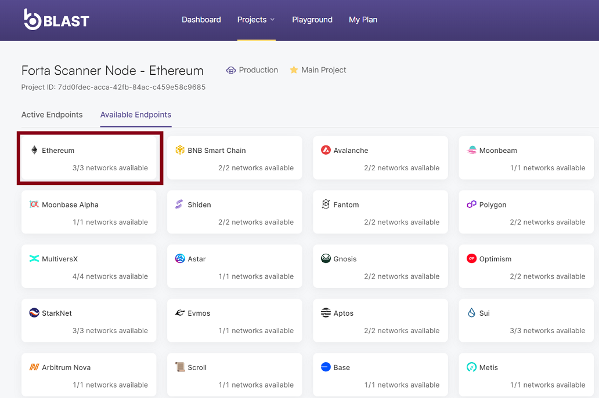
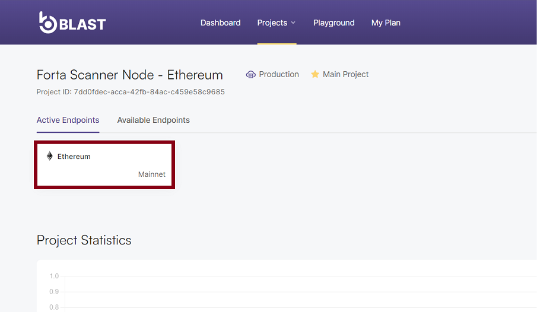

# Scan with Blast API by Bware Labs

## What’s the problem and how can it be solved?

As many of you know, Forta is a blockchain protocol that scans various networks for events indicating malicious activity, with the help of multiple node operators running scan nodes.

To run a scan node, you need access to reliable and efficient blockchain endpoints for the networks being scanned. That's where [Blast API](https://blastapi.io/) comes in. We propose that Forta scan nodes use Blast for spinning up blockchain endpoints that would enable running Forta scan nodes.

## Why Use Blast?

As the first and primary product developed under the Bware Labs umbrella, Blast is a blockchain API platform that provides easy blockchain access to the most relevant networks in the space. Using Blast, developers are able to get RPC, REST and WebSocket access to an ever-growing number of blockchain networks in just a couple of simple steps.

Blast sets itself apart in the blockchain API space by offering exceptional quality, performance, and user-friendliness. It achieves this by decentralizing its infrastructure through the onboarding of third-party node providers. This approach is innovative as it incorporates a reward model for node runners, incentivizing them to participate and enhancing the platform's decentralization. Ultimately, this leads to improved access to supported blockchains.

## Forta Scanner Plan

We are pleased to introduce Forta Scanner Plan, a subscription model designed by Bware Labs for Forta Protocol and its community of node operators.

This will enable Forta node operators to run a scan node leveraging Blast decentralized API protocol for all the networks supported within the platform.

The main benefits of using Forta Scanner Plan in Blast are as follows:

- You don’t have to manage your blockchain nodes by yourself and you can spin one in less than 1 minute;

- You can improve your scan SLAs by having access to all API calls supported including but not limited to trace_block, eth_getlogs and eth_getBlockByNumber

- You can moderately increase scan SLAs using your Blast endpoints for API calls made by Forta Agents( this practice has already been proven in house)

- Blast aligns with Forta’s vision of decentralization by fetching blockchain data in a decentralized manner through our onboarded node operators (check [blog post](https://medium.com/bware-labs/blast-api-mainnet-is-finally-here-bdc09093cad8))

- You leverage the best price in the market 25M API calls for only 35$ and it is exclusively available for Forta Node Operators; Each additional 25M API calls you provision will cost 35$. You will be able to scale as you go in case the provisioned amount of calls is not enough. (Eg: 25M = 35$; 50M = 70$; 75M = 105$)

- You would benefit from a throughput of 50 API calls/s for each 25M API calls you provision

## How to get a Blast Endpoint? (or more)

1. You have to visit our platform first - [https://blastapi.io](https://blastapi.io).

2. Click on **“Launch App”** button and select **“Consumer App”**.


3. Connect your MetaMask wallet and sign a message to complete registration.


4. Once you have reached your dashboard, you can create a new project where you'll be able to generate your required endpoints in order to start development. You will be able to create a different project for each network you plan to run scan nodes.


5. Create your first project by clicking **“Add Project”** as in the image above, fill in the required details and click on the **"Create Project"** button:


6. Once your project is created, you will be able to navigate to the **"Available Endpoints"** tab and choose any of our supported networks. For this tutorial, we have chosen to create an Ethereum Mainnet endpoint.



7. Next, you have to choose the network you want to spin an endpoint for Testnet or Mainnet, and click **“Activate”**.


8. After activating the endpoint you will be redirected to the **Active Endpoints”** tab where the network you just spin an endpoint for will be displayed. 


9. Now you can click on the above button and get the endpoint URLs.


You can also check our docs and [tutorial](https://docs.blastapi.io/blast-documentation/tutorials-and-guides/consumer-app/get-a-blockchain-endpoint-in-blast-using-wallet-connect) for spinning an endpoint.

## How to get access to Forta Scanner Plan?

Simply fill out this one-minute [form](https://forms.gle/2zpxpzywMQoSo16n7) and leave the rest to us. Your Forta Scanner Plan will be assigned in “My Plan” tab in 2 days, at most, since form submission.

## Scan all supported networks with Blast.

If you have not yet installed Forta on your terminal, we recommend going through the quickstart [guide](https://docs.forta.network/en/latest/scanner-quickstart/) to start your Forta scan node. 

Once you have initialized your Forta directory, you will find a file called config.yml. This file needs to be configured so that your scan node can access the blockchain data.

To enable Forta detection bots to call JSON-RPC APIs using the configured RPC endpoints and chain ID, you will need to initialize the *scan.jsonRpc.url* property in the *config.yml* file with the Blast RPC URL obtained in the previous section.

To do this, simply open the config.yml file in your Forta directory and copy the Blast RPC URL into the jsonRpc property. With this setup, your Forta scan node will be able to effectively pull data from the blockchain and identify any events indicating malicious activity.

### Ethereum 

```
chainId: 1

scan:
  jsonRpc:
    url: https://eth-mainnet.blastapi.io/<UID>

trace:
	jsonRpc:
    url: https://eth-mainnet.blastapi.io/<UID>
```

### Polygon
```
chainId: 137

scan:
  jsonRpc:
    url: https://polygon-mainnet.blastapi.io<UID>

trace:
	jsonRpc:
    url: https://polygon-mainnet.blastapi.io<UID>
```

### Optimism
```
chainId: 10

scan:
  jsonRpc:
    url: https://optimism-mainnet.blastapi.io/<UID>

trace:
    url: https://optimism-mainnet.blastapi.io/<UID>
```

### Arbitrum
```
chainId: 42161

scan:
  jsonRpc:
    url: https://arbitrum-one.blastapi.io/<UID>

trace:
    url: https://arbitrum-one.blastapi.io/<UID>
```

### Binance Chain
```
chainId: 56

scan:
  jsonRpc:
    url: wss://bsc-mainnet.blastapi.io/<UID>

trace:
    url: wss://bsc-mainnet.blastapi.io/<UID>
```


