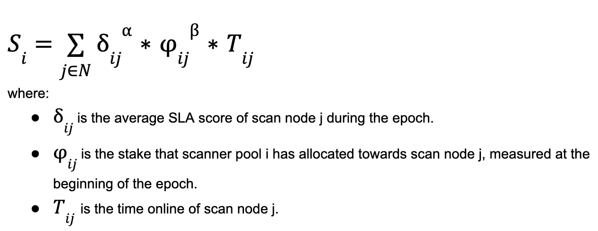
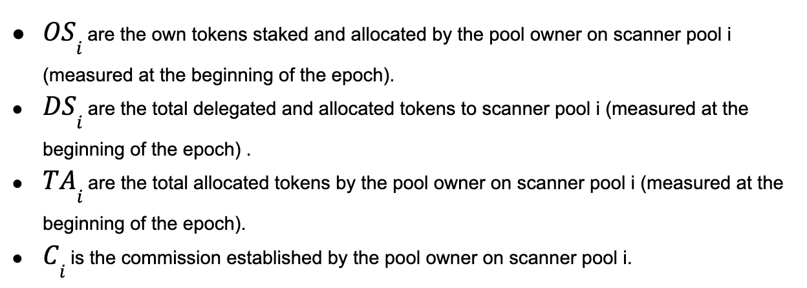

# Delegated Staking Rewards

## Claiming rewards

After the end of each epoch (each epoch is one week from, **Monday 00:00:00 UTC** to **Sunday 23:59:59 UTC**), reward calculation starts. The rewards are written to the rewards distributor contract as soon as the calculation is completed. FORT rewards are distributed to node pools. Rewards earned by each pool are written to the reward distribution smart contract and distributed between owners and delegators based on the rewards formula.

### Forta App

Visit "My Rewards" page from the top right menu in the [Forta App](https://app.forta.network)! You can see on the rewards page if you have any available rewards and claim rewards from multiple epochs with a single action. Please note that this is not available to token vault users. 

For token vault users, FORT rewards will automatically be re-delegated. Visit the “My Delegations” page from the top right menu in the Forta App to view your current deposited token holdings. 

### Polygonscan

To claim pool owner rewards over Polygonscan:

- visit the [`getCurrentEpochNumber`](https://polygonscan.com/address/0xf7239f26b79145297737166b0c66f4919af9c507#readProxyContract#F7) method and take a note of the epoch number,
- visit the [`claimRewards`](https://polygonscan.com/address/0xf7239f26b79145297737166b0c66f4919af9c507#writeProxyContract#F1) method
- click on "Connect to Web3" on the top and connect your wallet,
- and fill in:
    - **subjectType:** 2 for pool owner, 3 for delegator
    - **subjectId:** The pool ID to claim the rewards from
    - **epochNumbers:** Do number from first step minus 1 and input e.g. `[2561]` if the number was 2562
- click on "Write" to send the transaction.

This transaction may fail if you have no rewards from that epoch. To verify this over Polygonscan:

- visit the [`availableReward`](https://polygonscan.com/address/0xf7239f26b79145297737166b0c66f4919af9c507#readProxyContract#F1) method,
- and fill in:
    - **subjectType:** 2 for pool owner, 3 for delegator
    - **subjectId:** The pool ID to claim the rewards from
    - **epochNumber:** Same as in the `claimRewards` example above
    - **staker:** Your wallet address which you used to stake on this pool

## Formula

With the introduction of delegated staking, there are new reward formulas for pool owners and delegators. These formulas seek to

- encourage node runners to ensure the reliability and performance of the Forta network by achieving the highest possible SLA scores in their nodes,
- encourage node runners and delegators to stake more and increase the economic security of the network.

The approach involves distributing rewards to participants as a function of the proportional scan node SLA, scan node uptime and allocated pool stake on the network, using the Cobb-Douglas production function.

!!! important "Important definitions"
    - **epoch duration**: 1 week, from Monday 00:00:00 UTC to Sunday 23:59:59 UTC
    - **commission becomes effective**: next epoch
    - **commission lockdown after any change**: two epochs (excluding the current one)

    These values are subject to change.

The score of scan node `j` during an epoch is:

Consequently, the total score of scanner pool `i` during an epoch is:

And the share of the rewards scanner pool `i` receives during an epoch is:

Consequently, the total amount of rewards allocated to scanner pool `i`, during an epoch is:

where `F` is the total amount of FORT rewards to all of the Forta scan nodes during the epoch.

Finally, the total amount of rewards allocated to scanner pool `i` is divided between the node runner of that pool and all the delegators to it:

Node runner rewards on scanner pool `i`: 

Delegator rewards on scanner pool `i`:
 

where:

The values of parameters α and β are set to 3 and 0.5 respectively and are subject to change in the future.

!!! important "Initial values"
    For new pools during their first week, the formulas will be modified slightly and instead of using the stake at the beginning of the epoch, the rewards will be calculated using the time-weighted average stake during the epoch. For the following epochs, the distribution will be based on the initial stake values in each epoch.

The total amount of the delegator rewards is distributed to each delegator proportionally to their initial deposited stake value in each epoch. The on-chain rules are the ultimate authority of this logic, and in the case where the on-chain rules differ from this, it will prevail.

[^1]: For this calculation, only the periods when the SLA is at least 0.75 are considered.

[^2]: For this calculation, only the periods where the stake is at least 2,500 are considered. When the stake is less than that, the node is not considered to be online, so that’s already captured on the time online parameter.

[^3]: Rewardable time online requires the SLA to be at least 0.75.
