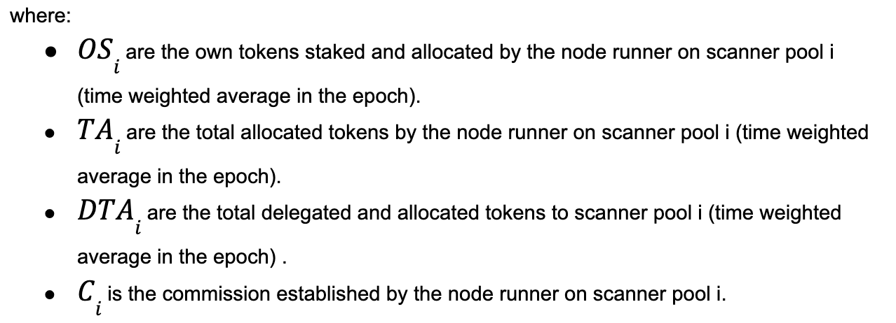

# Forta Rewards Formula

With the implementation of delegated staking, there are new reward formulas for node runners and delegators. These formulas seek to:

- Encourage node runners to have scan nodes with the highest possible SLA to ensure the reliability and performance of the Forta network.
- Encourage node runners and delegators to stake and increase the economic security of the network. 

The approach involves distributing rewards to participants as a function of their proportional SLA and stake on the network, using the Cobb-Douglas production function.
The score of scan node j during an epoch is:

Consequently, the total score of a scanner pool i during an epoch is:

And the share of the rewards scanner pool i receives during an epoch is:

Consequently, the total amount of rewards allocated to scanner pool i, during an epoch is:

where: 
F is the total amount of FORT rewards to scan nodes during the epoch.

Finally, that total amount of rewards allocated to scanner pool i is divided between the node runner of that pool and all the delegators to it:

Node runner rewards on scanner pool i: 

Delegators rewards on scanner pool i:
 

The values of parameters α and β are set to 3 and 0.5 respectively and are subject to change in the future.

How to Claim Rewards
To claim rewards users 
